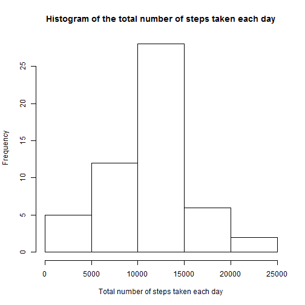
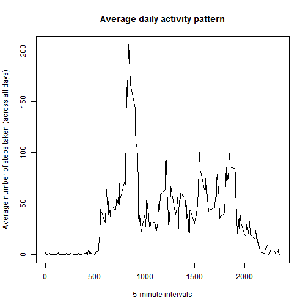
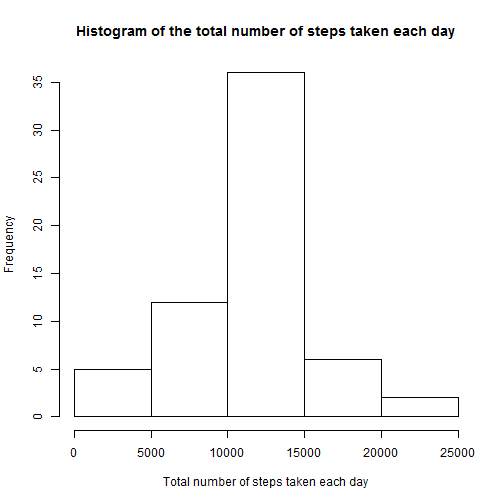
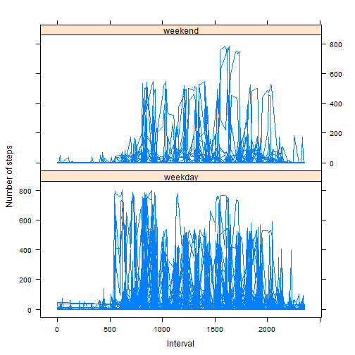

Reproducable Research Course Project 1
======================================


#Loading and preprocessing the data


```r
setwd("C:/Users/Gaurav/OneDrive/Documents/Summer 2016.2017/Coursera/Reproducable Research/Course project 1")
activity<-read.csv("activity.csv")
```

#What is mean total number of steps taken per day?
1. 

```r
byday <- aggregate(cbind(steps)~date,data=activity[complete.cases(activity),],FUN=sum)
hist(byday$steps, plot=TRUE, xlab = "Total number of steps taken each day", main = "Histogram of the total number of steps taken each day")
```



2. The mean number of steps is:

```r
mean(byday$steps)
```

```
## [1] 10766.19
```
The median number of steps is:

```r
median(byday$steps)
```

```
## [1] 10765
```
#What is the average daily activity pattern?
1.

```r
byinterval <- aggregate(cbind(steps)~interval,data=activity[complete.cases(activity),],FUN=mean)
plot(byinterval, type = "l", main = "Average daily activity pattern", xlab = "5-minute intervals", ylab = "Average number of steps taken (across all days)")
```



2. The interval with the maximum average number of steps is:

```r
byinterval[byinterval$steps==max(byinterval$steps),]$interval
```

```
## [1] 835
```

#Imputing missing values
1. The number of NA's in the dataset are:

```r
sum(is.na(activity$steps))
```

```
## [1] 2304
```

2. I will substitute the mean number of steps across all days in place of any NA's

3. 

```r
imputedData<-activity
i = 1
numRows<-nrow(imputedData)
while(i<=numRows){
  if(is.na(imputedData$steps[i])){
    imputedData$steps[i]<-byinterval[imputedData$interval[i]==byinterval$interval,]$steps
  }
  i=i+1
}
```
4. 

```r
byday_imputed <- aggregate(cbind(steps)~date,data=imputedData,FUN=sum)
hist(byday_imputed$steps, plot=TRUE, xlab = "Total number of steps taken each day", main = "Histogram of the total number of steps taken each day")
```


The mean number of steps is:

```r
mean(byday_imputed$steps)
```

```
## [1] 10766.19
```
The median number of steps is:

```r
median(byday_imputed$steps)
```

```
## [1] 10766.19
```
Since the value used to impute the data is the mean, the mean daily number of steps does not change from before. Notice that the median number of daily steps does change since days where no data has been collected now have the same mean as the grand mean.

#Are there differences in activity patterns between weekdays and weekends?
1. 

```r
factorVariable<-weekdays(as.Date(imputedData$date))
isWeekday<-c()
isWeekday[factorVariable!=c("Saturday", "Sunday")]<-"weekday"
isWeekday[factorVariable==c("Saturday", "Sunday")]<-"weekend"
imputedData<-cbind(imputedData, isWeekday)
```

2. 

```r
byinterval <- aggregate(cbind(steps)~interval+isWeekday,data=imputedData,FUN=mean)
require(lattice)
xyplot(steps ~ interval| factor(imputedData$isWeekday), 
           data = imputedData,
           type = "l",
           xlab = "Interval",
           ylab = "Number of steps",
           layout=c(1,2))
```


